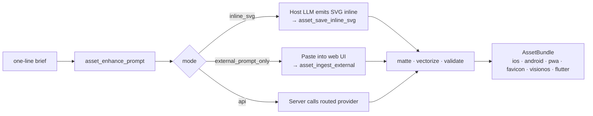

<div align="center">


<h1 align="center">prompt-to-asset</h1>

<p align="center">
  <strong>MCP server and CLI for developer assets.</strong><br/>
  One brief produces a validated, ship-ready bundle — app icons, favicons, OG images, logos, splash screens, SVG.<br/>
  Routes to the right image model, mattes, vectorizes, and fans out to every platform. With or without an API key.
</p>

<p align="center">
  <a href="https://www.npmjs.com/package/prompt-to-asset"></a>
  <a href="https://www.npmjs.com/package/prompt-to-asset"></a>
  <a href="https://github.com/MohamedAbdallah-14/prompt-to-asset/actions/workflows/ci.yml"></a>
  <a href="https://codecov.io/gh/MohamedAbdallah-14/prompt-to-asset"></a>
  <a href="./LICENSE"></a>
  <a href="https://nodejs.org"></a>
  <a href="https://modelcontextprotocol.io"></a>
  <a href="#zero-key-quickstart"></a>
</p>

<p align="center">
  <a href="cursor://anysphere.cursor-deeplink/mcp/install?name=prompt-to-asset&config=eyJjb21tYW5kIjogIm5weCIsICJhcmdzIjogWyIteSIsICJwcm9tcHQtdG8tYXNzZXQiXX0="></a>
  <a href="vscode:mcp/install?%7B%22name%22%3A%20%22prompt-to-asset%22%2C%20%22type%22%3A%20%22stdio%22%2C%20%22command%22%3A%20%22npx%22%2C%20%22args%22%3A%20%5B%22-y%22%2C%20%22prompt-to-asset%22%5D%7D"></a>
  <a href="vscode-insiders:mcp/install?%7B%22name%22%3A%20%22prompt-to-asset%22%2C%20%22type%22%3A%20%22stdio%22%2C%20%22command%22%3A%20%22npx%22%2C%20%22args%22%3A%20%5B%22-y%22%2C%20%22prompt-to-asset%22%5D%7D"></a>
  <a href="https://github.com/MohamedAbdallah-14/prompt-to-asset/releases/latest"></a>
  <a href="https://smithery.ai/server/prompt-to-asset"></a>
</p>

<p align="center">
  <a href="#zero-key-quickstart">Quickstart</a>
  &nbsp;·&nbsp;
  <a href="#the-three-modes">The three modes</a>
  &nbsp;·&nbsp;
  <a href="#the-router">Router</a>
  &nbsp;·&nbsp;
  <a href="#mcp-tool-surface-24-tools">MCP tools</a>
  &nbsp;·&nbsp;
  <a href="./GETTING_STARTED.md">Getting started</a>
  &nbsp;·&nbsp;
  <a href="./docs/RESEARCH_MAP.md">Research</a>
  &nbsp;·&nbsp;
  <a href="./CHANGELOG.md">Changelog</a>
</p>

</div>

---

## Zero-key quickstart

You do not need an API key to use this repo. A literal HTTP GET, then one offline command:

```bash
# Zero signup. Pollinations routes to Flux / Turbo / Kontext / SD behind the scenes.
curl -o logo.png "https://image.pollinations.ai/prompt/minimal+flat+vector+logo+mark+for+a+tech+startup+pure+white+background?model=flux&width=1024&height=1024&nologo=true"

# Fan it out to every platform, offline, no key.
npx prompt-to-asset export logo.png --platforms ios,android,pwa,favicon,flutter,visionos
```

You end up with `AppIcon.appiconset`, Android adaptive layers (Android 13 monochrome included), PWA 192/512/512-maskable, a full favicon bundle, a Flutter `launcher_icons.yaml` pre-wired, and a visionOS parallax scaffold. Rate limit on the anonymous Pollinations lane is roughly 1 request per 15 seconds. The output is RGB; if you need a transparent mark, run `asset_remove_background` after.

### Free paths beyond Pollinations

| Option                     | How                             | Best at                        | Catch                                     |
| -------------------------- | ------------------------------- | ------------------------------ | ----------------------------------------- |
| **Pollinations.ai**        | `curl` → HTTP GET. No signup.   | Flux-quality raster, instantly | ~1 req / 15s anonymous, RGB only          |
| **Stable Horde**           | Anonymous kudos queue           | SDXL, Flux community GPUs      | Minutes of queue on the free lane         |
| **HF Inference**           | Free read token                 | SDXL, SD3, Flux dev + schnell  | Rate-limited, cold-start latency          |
| **Google AI Studio**       | Free `GEMINI_API_KEY`           | Nano Banana, ~1,500 images/day | No real transparency; matte externally    |
| **Local ComfyUI**          | Community `comfyui-mcp` adapter | Full fidelity, no caps         | You bring the GPU                         |
| **`inline_svg`**           | Host LLM emits `<svg>` in chat  | Logos, favicons, simple icons  | ≤40 paths; simple geometry                |
| **`external_prompt_only`** | Paste into any web UI           | Whatever that UI gives you     | Manual save, then `asset_ingest_external` |

Run `p2a doctor` or ask your assistant for `asset_doctor()` to see what's live in your environment right now.

---

## Why this exists

Two facts shape everything here.

> **Producing production-grade software assets is a routing and post-processing problem, not a prompt-engineering problem.**

Imagen 3/4 and Gemini Flash Image can't produce real RGBA PNGs. Their VAE is RGB-only, so asking for a transparent background renders the grey-and-white checkerboard _as pixels_. SDXL can't spell past ~8 characters. Only Recraft emits native SVG. Flux errors on `negative_prompt`. None of that is visible in the model UI. All of it silently breaks one-shot "prompt → asset" tools.

> **The user may not have an image-model API key. The plugin works anyway.**

Every one of the three modes can finish on $0.

---

## The three modes



| Mode                       | Key?     | What happens                                                                                                                                                                                                                                                                                                                                     | Best for                                                       |
| -------------------------- | -------- | ------------------------------------------------------------------------------------------------------------------------------------------------------------------------------------------------------------------------------------------------------------------------------------------------------------------------------------------------ | -------------------------------------------------------------- |
| **`inline_svg`**           | No       | Server returns an SVG-authoring brief (viewBox, palette, path budget ≤ 40). Host LLM emits `<svg>…</svg>` inline, then calls `asset_save_inline_svg` to write master + favicon.ico + apple-touch + AppIconSet + PWA bundle. Instant. Deterministic.                                                                                              | logos, favicons, icon packs, stickers, simple app-icon masters |
| **`external_prompt_only`** | No       | Server returns the dialect-correct prompt plus a ranked list of paste targets, free paths first: Pollinations, HF Inference, Stable Horde, Google AI Studio, Ideogram, Recraft, Midjourney, fal.ai, BFL, ChatGPT, Firefly, Krea. Generate elsewhere, save locally, call `asset_ingest_external`.                                                 | anything; best for illustrations, heroes, text-heavy logos     |
| **`api`**                  | Optional | Server calls the provider directly. Works **zero-key via Pollinations / Horde / HF**, or with paid keys (`OPENAI_API_KEY`, `IDEOGRAM_API_KEY`, `RECRAFT_API_KEY`, `BFL_API_KEY`, `GEMINI_API_KEY`, `STABILITY_API_KEY`, `LEONARDO_API_KEY`, `FAL_API_KEY`). Route → generate → matte → vectorize → export → validate → content-addressed bundle. | automation, CI, no rate-limit tolerance                        |

The host LLM picks the mode, or you do. The server surfaces `modes_available` so the assistant can offer them to you. Free paths first — always.

---

## Install

```bash
# No install — every command works via npx
npx prompt-to-asset doctor           # what's live in this shell right now
npx prompt-to-asset doctor --fix     # auto-install native deps (brew / cargo / scoop; never sudo)
npx prompt-to-asset pick             # interactive route picker
npx prompt-to-asset init --register  # scaffold brand.json + register in .cursor / .vscode / .windsurf

# Or global for daily use
npm i -g prompt-to-asset
p2a doctor

# Or per-project for CI
npm i -D prompt-to-asset
```

Register as an MCP server so your assistant drives it:

```bash
claude mcp add prompt-to-asset -- p2a          # Claude Code
npx -y @smithery/cli install prompt-to-asset --client claude   # Smithery (universal)
```

For Cursor / VS Code / Windsurf / Codex / Gemini CLI, the exact stanza per IDE is in [`docs/install.md`](./docs/install.md). Claude Desktop users: download the [`.mcpb` bundle](https://github.com/MohamedAbdallah-14/prompt-to-asset/releases/latest) and double-click. Restart your IDE after.

Once registered, your assistant has the full **24 `asset_*` tool** surface.

### The design thesis

You own the API keys. The LLM owns everything else.

The only thing that happens in a terminal is installing the package and putting keys in `.env`. Secrets shouldn't pass through chat. Every other verb — doctor checks, model inspection, platform fan-out, brand scaffolding, sprite sheets, 9-slice configs — is an MCP tool the assistant calls when you ask in natural language.

So the user experience is: _"generate a favicon for my Next.js app, dark-mode aware"_. The assistant chains `asset_init_brand` → `asset_enhance_prompt` → `asset_generate_favicon` → `asset_save_inline_svg`, then reports the file paths. Zero CLI typing.

The CLI is still first-class for CI, shell scripts, and anyone not using an MCP-aware IDE. Both surfaces hit the same core.

---

## What your AI assistant does

In a new chat:

> Make me a transparent logo for a developer-tools company called Forge. Flat vector, two-tone warm orange on neutral.

Behind the scenes:

1. `asset_doctor()` — check what modes and providers are live.
2. `asset_init_brand({ app_name: "Forge", palette: ["#EA580C", "#F5F5F4"] })` if no `brand.json` exists.
3. `asset_enhance_prompt({ brief })` returns the `AssetSpec`: classification, rewritten prompt, `modes_available[]`, optional `svg_brief`, optional `paste_targets`, and a `routing_trace` that points at the research file backing the decision plus `never_models` (why Imagen or DALL·E got rejected).
4. Assistant offers you `inline_svg` / `external_prompt_only` / `api`.
5. If `inline_svg`: it writes the `<svg>` inline in the chat and calls `asset_save_inline_svg`. That writes `master.svg`, favicon.ico, apple-touch, AppIconSet, PWA bundle to disk.
6. If `external_prompt_only`: assistant shows the refined prompt and the best paste target (free first). You generate, save, then tell the assistant to call `asset_ingest_external <file>`.
7. If `api`: assistant calls the routed provider. Server mattes, vectorizes, exports, validates.
8. Follow-up: _"also fan this out for iOS and Android"_ → `asset_export_bundle` with the saved master.

---

## The router

Router decisions live in [`data/routing-table.json`](./data/routing-table.json). Capability matrix in [`data/model-registry.json`](./data/model-registry.json). Every rule cites its research source.

| Need                     | Primary                                                         | Fallback                                            | Never                              |
| ------------------------ | --------------------------------------------------------------- | --------------------------------------------------- | ---------------------------------- |
| Transparent PNG mark     | `gpt-image-1` with `background:"transparent"`                   | Ideogram 3 Turbo `style:"transparent"` → Recraft V3 | Imagen, Gemini Flash Image, SD 1.5 |
| Logo with 1–3 word text  | Ideogram 3 Turbo → `gpt-image-1` → Recraft V3                   | Composite SVG type over mark                        | Imagen, SD 1.5, `flux-schnell`     |
| Logo with >3 word text   | **Never a diffusion sampler.** Mark + SVG typography composite. | —                                                   | —                                  |
| Native SVG               | Recraft V3                                                      | `inline_svg` (host LLM authors SVG)                 | Everyone else                      |
| Photoreal hero           | Flux Pro / Flux.2 → `gpt-image-1` → Imagen 4                    | SDXL + brand LoRA                                   | DALL·E 3                           |
| Iterate an existing mark | `flux-kontext-pro` (edit-only)                                  | Pollinations Kontext (free)                         | —                                  |
| Zero-key everything      | Pollinations (Flux) → `inline_svg` for simple marks             | Stable Horde → HF Inference → paste-only web UI     | —                                  |

The `Never` column matters. It's why `prompt-to-asset` refuses to render wordmarks past 3 words in any diffusion sampler, and why asking for a transparent PNG never goes to Imagen.

---

## Models covered

**Paid direct APIs:** `gpt-image-1`, `gpt-image-1.5`, `dall-e-3` (deprecated 2026-05-12), `imagen-3`, `imagen-4`, `gemini-3-flash-image` (Nano Banana), `gemini-3-pro-image`, `sd-1.5`, `sdxl`, `sd3-large`, `playground-v3`, `flux-schnell`, `flux-dev`, `flux-pro`, `flux-2`, `flux-kontext-pro`, `ideogram-3`, `ideogram-3-turbo`, `recraft-v3`, `leonardo-phoenix`, `leonardo-diffusion-xl`, `fal-flux-pro`, `fal-flux-2`, `fal-sdxl`.

**Free-tier / zero-key:** `pollinations-flux`, `pollinations-turbo`, `pollinations-kontext`, `pollinations-sd`, `horde-sdxl`, `horde-flux`, `hf-sdxl`, `hf-sd3`, `hf-flux-schnell`, `hf-flux-dev`.

**Paste-only surfaces:** `midjourney-v6`, `midjourney-v7`, `firefly-3`, `krea-image-1`. Calling `asset_generate_*` with `mode: "api"` against a paste-only primary soft-falls-back to the first API-reachable model in the chain and surfaces a warning. If the whole chain is paste-only, you get an `ExternalPromptPlan` rather than an error.

---

<details>
<summary><b>MCP tool surface (24 tools)</b></summary>

| Tool                           | Purpose                                                                                                                                                                                                                                          |
| ------------------------------ | ------------------------------------------------------------------------------------------------------------------------------------------------------------------------------------------------------------------------------------------------ |
| `asset_capabilities`           | Inventory of modes + providers. Buckets paid / free-tier / paste-only; surfaces zero-key routes first. Read-only.                                                                                                                                |
| `asset_enhance_prompt`         | Classify, route, rewrite. Returns modes + `svg_brief` + `paste_targets` + `routing_trace { research_sources, never_models, fallback_chain }` + `clarifying_questions[]` when the brief is ambiguous. Read-only.                                  |
| `asset_generate_logo`          | `inline_svg` / `external_prompt_only` / `api`. Returns `InlineSvgPlan` / `ExternalPromptPlan` / `AssetBundle`.                                                                                                                                   |
| `asset_generate_app_icon`      | Same three modes. `api` produces full iOS / Android / PWA / visionOS / Flutter fan-out. Set `ios_18_appearances: true` for dark + tinted variants.                                                                                               |
| `asset_generate_favicon`       | `favicon-{16,32,48}.png`, `icon.svg`, `icon-dark.svg`, `apple-touch`, PWA 192/512/512-maskable, `<link>` snippet, `manifest.webmanifest`.                                                                                                        |
| `asset_generate_og_image`      | 1200×630 via Satori + `@resvg/resvg-js`. Deterministic typography, no diffusion-rendered text garbage.                                                                                                                                           |
| `asset_generate_illustration`  | `external_prompt_only` / `api`. Brand-locked via bundle refs, LoRA, or `style_id`. Routed primary: Flux.2 (up to 8 refs).                                                                                                                        |
| `asset_generate_splash_screen` | iOS `LaunchScreen-2732.png`, Android `mipmap-*/splash.png` + theme XML, PWA splash + README. Pass `existing_mark_svg` to reuse an approved mark.                                                                                                 |
| `asset_generate_hero`          | Marketing hero art (16:9 / 21:9 / 3:2 / 2:1). `external_prompt_only` / `api`.                                                                                                                                                                    |
| `asset_save_inline_svg`        | Round-trip for `inline_svg`. Validates the SVG against the brief, writes the bundle.                                                                                                                                                             |
| `asset_ingest_external`        | Round-trip for `external_prompt_only`. Matte → vectorize → validate → bundle.                                                                                                                                                                    |
| `asset_remove_background`      | BiRefNet / BRIA RMBG-2.0 / LayerDiffuse / difference matte / U²-Net.                                                                                                                                                                             |
| `asset_vectorize`              | `vtracer` / `potrace` / Recraft / posterize fallback, then SVGO.                                                                                                                                                                                 |
| `asset_upscale_refine`         | DAT2 / Real-ESRGAN / SUPIR / img2img / Lanczos; asset-type-aware.                                                                                                                                                                                |
| `asset_validate`               | Tier-0 (dims, alpha, checkerboard FFT, safe-zone bbox, ΔE2000 palette, WCAG contrast, OCR Levenshtein). Tier-2 VLM-as-judge via `PROMPT_TO_BUNDLE_VLM_URL`.                                                                                      |
| `asset_brand_bundle_parse`     | Parse `brand.json` / DTCG tokens / AdCP / Markdown into a canonical `BrandBundle`.                                                                                                                                                               |
| `asset_doctor`                 | Structured env inventory: native deps (sharp, vtracer, potrace, png-to-ico, satori, resvg-js, tesseract.js, svgo), free-tier routes ranked best-first, paid keys, paste-only surfaces, pipeline URLs, mode flags, "what to try next." Read-only. |
| `asset_models_list`            | Browse the 60+ model registry with filters: `free` / `paid` / `paste_only` / `rgba` / `svg`. Read-only.                                                                                                                                          |
| `asset_models_inspect`         | Full capability dump for one model id (or aka alias). Strengths, weaknesses, paste targets, routing rules, env status. Read-only.                                                                                                                |
| `asset_export_bundle`          | Fan a 1024² master PNG into iOS AppIconSet + Android adaptive + PWA maskable + visionOS parallax + Flutter launcher + favicon. Offline.                                                                                                          |
| `asset_sprite_sheet`           | Pack PNG/WEBP/JPG frames into a sprite sheet + TexturePacker-compatible JSON atlas (Phaser / PixiJS / Godot / Unity). Offline.                                                                                                                   |
| `asset_nine_slice`             | Emit a 9-slice config + CSS `border-image` + engine-ready numbers (Unity / Godot / Phaser / PixiJS) from an image plus four pixel guides. Optional Android `.9.png`.                                                                             |
| `asset_init_brand`             | Scaffold `brand.json` and ensure the assets dir exists. Auto-detects Next.js, Expo, Flutter, Xcode, Astro, Vite, Remix, Nuxt, React Native, Electron, Node.                                                                                      |
| `asset_train_brand_lora`       | Wrap a user-owned LoRA training endpoint (`PROMPT_TO_BUNDLE_MODAL_LORA_TRAIN_URL`). Path-guarded; validates inputs.                                                                                                                              |

Tools are annotated `readOnlyHint` / `idempotentHint` so Cursor auto-approves without prompting.

</details>

<details>
<summary><b>CLI surface</b></summary>

Used by the LLM over `Bash` when MCP isn't registered yet, and by CI. Every read-only command accepts `--json`.

```
p2a                          # default — MCP stdio server
p2a mcp                      # same, explicit
p2a export <master.png>      # offline platform fan-out
p2a export <master.png> --json
p2a init                     # interactive brand.json + IDE registration hints
p2a init --register          # + auto-write .cursor/mcp.json / .vscode/mcp.json / .windsurf/mcp.json
p2a pick                     # interactive model picker
p2a doctor                   # environment inventory
p2a doctor --json            # structured output
p2a doctor --data            # check data/model-registry.json ↔ data/routing-table.json consistency
p2a doctor --fix             # auto-install missing native deps (brew / cargo / scoop; never sudo)
p2a models list              # --free | --paid | --paste-only | --rgba | --svg
p2a models inspect <id>      # full capability dump
p2a sprite-sheet <dir>       # pack frames → PNG + atlas
p2a nine-slice <image>       # 9-slice JSON + CSS + engine numbers + .9.png
p2a --help
```

</details>

<details>
<summary><b>Brand bundle — brand.json</b></summary>

```json
{
  "name": "Halcyon",
  "palette": ["#2563eb", "#ffffff"],
  "fonts": { "display": { "family": "Inter", "weights": [700, 800] } },
  "style_refs": ["https://…/sample1.png", "./refs/style2.png"],
  "do_not": ["drop shadows", "heavy gradients"],
  "lora": "halcyon-flux-v2",
  "sref_code": "--sref 1234567890",
  "style_id": "rc_halcyon_01"
}
```

`p2a init` writes this for you, detecting the framework and suggesting an assets directory. Once present, every generator reads from it automatically.

</details>

<details>
<summary><b>Architecture</b></summary>

```
  brief (text)
    ↓  asset_capabilities         → modes available + free/paid/paste-only bucketing
    ↓  asset_enhance_prompt       → AssetSpec {
    ↓                                  routing_trace: { rule_id, reason, research_sources, never_models, fallback_chain },
    ↓                                  modes_available,
    ↓                                  svg_brief?,         (inline_svg)
    ↓                                  paste_targets?,     (external_prompt_only)
    ↓                                  rewritten_prompt, …
    ↓                                }
    ↓
    ├─ mode: inline_svg                → host LLM emits <svg>; asset_save_inline_svg writes bundle
    ├─ mode: external_prompt_only      → user pastes into web UI; asset_ingest_external runs matte → vectorize → validate
    └─ mode: api                       → provider(model, prompt, params) → matte → vectorize → upscale → export → validate
```

Content-addressed storage: `assets/<hash[0:2]>/<hash>/<variant>.<ext>`. The MCP server is synchronous and stateless. `prompt_hash` and `params_hash` in every `AssetBundle` are designed to drop straight into a BullMQ / SQS / Cloudflare Queues `jobId` for a hosted pipeline. Reference design: [`docs/research/18-asset-pipeline-tools/18e-production-pipeline-architecture.md`](./docs/research/18-asset-pipeline-tools/18e-production-pipeline-architecture.md).

</details>

<details>
<summary><b>Platform support</b></summary>

| Platform                                                                   | What you get                                                                                                                                                                                                      |
| -------------------------------------------------------------------------- | ----------------------------------------------------------------------------------------------------------------------------------------------------------------------------------------------------------------- |
| **iOS (Xcode)**                                                            | `AppIcon.appiconset` with 1024 opaque, squircle-ready. iOS 18 dark + tinted variants via `ios_18_appearances: true`.                                                                                              |
| **Android**                                                                | Adaptive foreground + background, Android 13 monochrome, all mipmap densities, optional `.9.png`.                                                                                                                 |
| **PWA / web**                                                              | `favicon.ico` (16/32/48 multi-res), `icon.svg` with `prefers-color-scheme` dark support, `apple-touch-icon.png` 180×180 opaque, 192/512/512-maskable, `manifest.webmanifest`, `<link>` snippet for your `<head>`. |
| **Flutter**                                                                | Pre-populated `flutter_launcher_icons.yaml` wiring iOS, Android adaptive, web, macOS, Windows.                                                                                                                    |
| **visionOS**                                                               | Three-layer parallax scaffold with a README. Layer split stays a human decision.                                                                                                                                  |
| **Next.js / Astro / Vite / Remix / Nuxt / Expo / React Native / Electron** | Framework detection via `p2a init` / `asset_init_brand` and a sensible output dir.                                                                                                                                |
| **Games**                                                                  | `sprite-sheet` produces TexturePacker-compatible atlases (Phaser, PixiJS, Godot, Unity). `nine-slice` emits engine-ready numbers.                                                                                 |

</details>

---

## Comparison

| Tool                                     | Prompt enhancement | Multi-model routing |              Zero-key               | Dev-asset bundle |                Offline platform fan-out                |
| ---------------------------------------- | :----------------: | :-----------------: | :---------------------------------: | :--------------: | :----------------------------------------------------: |
| Promptati / PromptHero                   |   cinematic only   |          ✗          |                  ✗                  |        ✗         |                           ✗                            |
| Looka / Brandmark / Designs.ai           |         ✗          |          ✗          |                  ✗                  |     partial      |                           ✗                            |
| ChatGPT / Midjourney / Ideogram (direct) |         ✗          |          ✗          |                  ✗                  |        ✗         |                           ✗                            |
| appicon.co                               |         ✗          |          ✗          |                  ✓                  |     partial      |                        iOS only                        |
| flutter_launcher_icons                   |         ✗          |          ✗          |                  ✓                  |     partial      |                     iOS + Android                      |
| **`prompt-to-asset`**                    |         ✓          |   ✓ (60+ models)    | ✓ (Pollinations / HF / Horde / SVG) |        ✓         | ✓ (iOS + Android + PWA + visionOS + favicon + Flutter) |

---

## Security

This tool handles API keys for up to 15 providers. Non-negotiables:

- **Keys live in env vars only.** Never written to disk, never logged, never echoed in MCP responses. Provider error bodies go through `redact()` (`packages/mcp-server/src/security/redact.ts`) before reaching the host LLM.
- **Path access is allow-listed.** `image_path` / `output_dir` / `existing_mark_svg` resolve through symlinks and reject anything escaping the project cwd + configured output dir + cache dir + OS tempdir. A malicious MCP client can't read `/etc/passwd` or write to `/etc/cron.d`. Widen with `P2A_ALLOWED_PATHS=/path1:/path2`.
- **SVG is XSS-sanitized before any write.** `<script>`, `<foreignObject>`, `on*=` handlers, `javascript:` URIs, external `<image href>` / `<use href>`, CSS `@import` over the network: all rejected. The check runs unconditionally; SVGO is not required.
- **Cost guardrail.** Set `P2A_MAX_SPEND_USD_PER_RUN=5.00` to cap any single tool call. Pre-flight estimate refuses to call if over. Free-tier routes are always $0.
- **Data integrity at boot.** `assertDataIntegrityAtBoot()` runs on start. If a routing rule points at a model id not in the registry, the server refuses to boot with a clear error. Check in CI with `p2a doctor --data`.
- **No telemetry. No remote calls unless the routed provider explicitly requires one.**

Full policy: [SECURITY.md](./SECURITY.md).

---

## Zero-sticky-note policy

Every routing rule, dialect switch, safe-zone size, and text ceiling that's implemented is backed by a file under [`docs/research/`](./docs/research/). `asset_enhance_prompt` returns a `routing_trace.research_sources` array on every call. The angle → code pointer map, plus an honest ledger of what's wired and what's deferred, lives in [`docs/RESEARCH_MAP.md`](./docs/RESEARCH_MAP.md).

---

## Development

```bash
git clone https://github.com/MohamedAbdallah-14/prompt-to-asset.git
cd prompt-to-asset
npm install
npm run build
npm run typecheck
npm run lint
npm test               # vitest watch
npm run test:run       # vitest run (CI)
npm run smoke          # list tools via MCP stdio + correctness assertions
npm run sync           # regenerate IDE mirrors from SSOTs
npm run verify         # byte-verify mirrors match SSOTs
```

SSOTs live in `skills/*/SKILL.md`, `rules/*.md`, `.claude-plugin/`, and `data/*.json`. Don't edit `.cursor/`, `.claude/`, `.windsurf/` directly — they're regenerated by `scripts/sync-mirrors.sh` and CI byte-verifies them.

Contribution flow: [CONTRIBUTING.md](./CONTRIBUTING.md). User on-ramp: [GETTING_STARTED.md](./GETTING_STARTED.md). Common snags: [TROUBLESHOOTING.md](./TROUBLESHOOTING.md). Release notes: [CHANGELOG.md](./CHANGELOG.md).

---

## Community

- **Issues + feature requests:** [GitHub Issues](https://github.com/MohamedAbdallah-14/prompt-to-asset/issues)
- **Security disclosures:** see [SECURITY.md](./SECURITY.md)
- **Code of Conduct:** [CODE_OF_CONDUCT.md](./CODE_OF_CONDUCT.md)
- **Star history:** [star-history.com/#MohamedAbdallah-14/prompt-to-asset](https://star-history.com/#MohamedAbdallah-14/prompt-to-asset&Date)

If this repo saved you from hand-crafting another AppIconSet, leaving a star helps it reach other developers fighting the same fight.

---

## License

MIT. See [LICENSE](./LICENSE).

<div align="center">
<sub>Built on a 34-category research compendium. See <a href="./docs/research/SYNTHESIS.md">SYNTHESIS.md</a> and <a href="./docs/RESEARCH_MAP.md">RESEARCH_MAP.md</a>.</sub>
</div>
