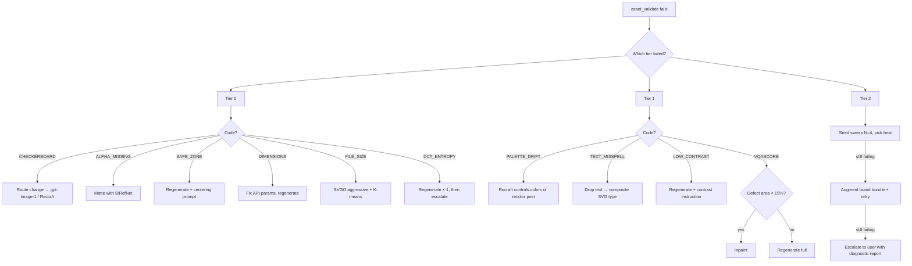

# Asset Validation + Pipeline Debugging Skill — Design Spec

A dedicated `asset-validation-debug` skill bridges P2A's tier-0/1/2 validation system and `superpowers:systematic-debugging` into a production-grade failure recovery workflow.

---

## 1. Failure Taxonomy

### Tier 0 — Deterministic (always checked)

| Code | Name | Origin | Signal |
|---|---|---|---|
| `T0_CHECKERBOARD` | Checkerboard transparency artifact | VAE decode (RGB model treating alpha as color) | FFT peak at 50% frequency; gray/white alternating squares |
| `T0_ALPHA_MISSING` | Alpha channel absent on transparency-required asset | Model rendered to RGB only | PNG has no alpha channel; matte not applied |
| `T0_DIMENSIONS` | Image dimensions mismatch | Generation width/height params wrong | Actual px ≠ spec px |
| `T0_SAFE_ZONE` | Subject outside platform safe zone | Over-cropped composition, edge-bleed | Tight bbox centroid outside iOS 824², Android 72dp, PWA 80% |
| `T0_FILE_SIZE` | File too large | Over-detailed SVG, uncompressed raster | >2 MB logo, >10 KB favicon |
| `T0_DCT_ENTROPY` | Low DCT entropy (solid-color patch, noise pattern) | Generation failure / NSFW filter triggered | Entropy metric below threshold |

### Tier 1 — Metric (checked on first asset or on failure)

| Code | Name | Origin | Signal |
|---|---|---|---|
| `T1_PALETTE_DRIFT` | Palette ΔE2000 > 10 vs brand palette | Model ignores hex constraints | ΔE2000 distance between output dominant colors and brand spec |
| `T1_TEXT_MISSPELL` | OCR Levenshtein distance > 1 vs intended wordmark | Diffusion sampler can't count/kern | OCR output diverges from intended text |
| `T1_LOW_CONTRAST` | WCAG AA contrast < 4.5:1 at target display size | Pale palette, similar foreground/background tones | Foreground/background luminance ratio < 4.5 |
| `T1_VQASCORE` | VQAScore below asset-type threshold | Prompt-to-image alignment failure | VQAScore < 0.72 (logo), < 0.65 (illustration) |

### Tier 2 — VLM-as-Judge (optional, requires `PROMPT_ENHANCER_VLM_URL`)

| Code | Name | Signal |
|---|---|---|
| `T2_BRAND_DRIFT` | Style diverges from brand reference assets | Claude Sonnet rubric score < 0.6 |
| `T2_COMPOSITION` | Off-center subject, clutter, poor negative space | VLM aesthetic score < threshold |

---

## 2. Repair Primitive Selection Matrix

| Failure | Primary repair | Fallback | Cost ratio | Notes |
|---|---|---|---|---|
| `T0_CHECKERBOARD` | **Regenerate — route change** (gpt-image-1, Ideogram v3, Recraft) | None | 4× | Architectural; different provider required |
| `T0_ALPHA_MISSING` | **Matte with BiRefNet** → `asset_remove_background` | RMBG-2.0 | 0.05× | Post-processing; no regeneration |
| `T0_SAFE_ZONE` | **Regenerate** with explicit centering + padding prompt | None | 4× | Prompt: "centered with 20% padding on all sides" |
| `T0_DIMENSIONS` | Fix API params; regenerate | None | 4× | Never send wrong `width`/`height` again |
| `T0_FILE_SIZE` (SVG) | SVGO with aggressive preset → reduce path count | Regenerate simpler | 0.01× | K-means color reduction first |
| `T0_DCT_ENTROPY` | Regenerate same params (likely NSFW filter) | Change prompt | 4× | 1 retry, then escalate |
| `T1_PALETTE_DRIFT` | **Recraft** with `controls.colors`, else recolor post | K-means remap | 0.05–4× | Post-processing preferred |
| `T1_TEXT_MISSPELL` | **Drop text; composite SVG type** | Retry Ideogram 3 (best-in-class) | 0× + SVG | Never retry >3× in diffusion |
| `T1_LOW_CONTRAST` | **Regenerate** with contrast instruction | Boost contrast post | 4× / 0.02× | Post-processing if mild |
| `T1_VQASCORE` | **Inpaint** defect area (< 15% of image) | Regenerate full | 0.3× / 4× | Choose inpaint if defect is local |
| `T2_BRAND_DRIFT` | **Seed sweep** (N=4, auto-score with CLIPScore + HPSv2) | Add more style refs | 4× | Augment brand bundle with accepted assets |
| `T2_COMPOSITION` | **img2img** with low denoise (0.35) | Regenerate full | 1× / 4× | Preserves layout; fixes global style |

---

## 3. Diagnosis Tree (Mermaid)



---

## 4. Retry Budget

| Failure code | Max retries | On exhaust |
|---|---|---|
| `T0_CHECKERBOARD` | 2 (route change each time) | Escalate to user — architectural issue |
| `T0_ALPHA_MISSING` | 1 (try matte, then try different matte model) | Escalate |
| `T0_SAFE_ZONE` | 1 (tighter centering prompt) | Escalate |
| `T0_DIMENSIONS` | 1 (fix params) | Should never exhaust |
| `T0_FILE_SIZE` | 1 (SVGO pass) | Escalate — path count is fundamental |
| `T1_PALETTE_DRIFT` | 1 regeneration OR 0 retries + post-process | Post-process is preferred |
| `T1_TEXT_MISSPELL` | 0 (composite immediately) | Always composite, don't retry diffusion for text |
| `T1_LOW_CONTRAST` | 2 (regenerate → post-process) | Escalate with contrast-boost warning |
| `T1_VQASCORE` | 2 (inpaint → full regen) | Escalate |
| `T2_*` | 1 seed sweep (4 seeds) | Escalate with diagnostic report |

---

## 5. Integration with `superpowers:systematic-debugging`

The four-phase debugging structure maps directly to P2A failures:

| Superpowers phase | P2A equivalent |
|---|---|
| **Phase 1 — Gather evidence** | Read `asset_validate()` output; identify tier + code; log generation params |
| **Phase 2 — Pattern analysis** | Classify failure (local/global/compositional) against taxonomy; consult repair matrix |
| **Phase 3 — Hypothesis** | Select repair primitive; estimate cost/time tradeoff |
| **Phase 4 — Implement + verify** | Apply repair; re-validate; check retry budget |

**Red flags** (P2A-specific):
- Multiple route changes for the same asset → architectural brief/routing problem
- Cascading repairs (matte → vectorize → safe-zone) → generation fundamentally failed
- Same failure code after 2+ retries → escalate, don't loop

---

## 6. Proactive Validation (Pre-Generation Checks)

Run before calling any `asset_generate_*` tool:

```
BRIEF CLARITY:
☐ Asset type in closed enum
☐ Subject noun present (not just adjectives)
☐ Prompt > 10 words
☐ No vague terms like "modern" or "nice" as sole descriptors

TEXT-IN-IMAGE:
☐ Quoted string > 12 chars? → plan composite SVG type
☐ Text > 5 words? → force composite, skip diffusion text

PALETTE:
☐ Brand palette provided? Count colors.
☐ > 4 hex codes → warn: over-constraint degrades some models

TRANSPARENCY:
☐ Transparency required + model in [Imagen, Gemini, Flux, SDXL]? → plan post-matte
☐ Transparency required + model = gpt-image-1? → set background="transparent" param

ROUTING:
☐ Text detected + model ≠ Ideogram/gpt-image-1? → suggest reroute
☐ Native SVG needed + model ≠ Recraft? → suggest Recraft or inline_svg mode
☐ Platform safe-zone spec matches asset_type?

RESOURCES:
☐ SVG inline_svg: estimated path count ≤ 40?
☐ Favicon: will this survive 16×16 downsampling? (1–2 colors, high contrast, simple shape)
```

---

## 7. Evidence Gathering per Pipeline Boundary

Log these at each component boundary to enable accurate failure diagnosis:

```
GENERATION:
- model, seed, guidance_scale, num_steps, prompt_hash
- response status code, latency

POST-MATTE:
- tool used (BiRefNet / RMBG / difference)
- alpha pixel count before/after
- checkerboard probe result

VECTORIZE:
- path count before/after SVGO
- color count (K-means)
- tool used (vtracer / potrace / Recraft)

EXPORT:
- output dimensions per variant
- file sizes
- format (PNG/SVG/ICO)

VALIDATE:
- tier_0: {dimensions: pass/fail, alpha: pass/fail, ...}
- tier_1: {palette_delta_e: 7.3, vqa_score: 0.69, ...}
- tier_2: {brand_similarity: 0.71} (if enabled)
```

---

## 8. Research References

- `docs/research/14-negative-prompting-artifacts/14b-artifact-taxonomy.md` — artifact taxonomy with origin points
- `docs/research/14-negative-prompting-artifacts/14c-regenerate-vs-repair-strategies.md` — repair primitives, cost/time tradeoffs
- `docs/research/03-evaluation-metrics/3e-asset-specific-eval.md` — VQAScore, OCR, WCAG, CSD thresholds
- `skills/asset-enhancer/SKILL.md` — "Validation" section (tier 0/1/2) and "Regenerate vs. repair" table
- `superpowers:systematic-debugging` skill — 4-phase debugging structure
